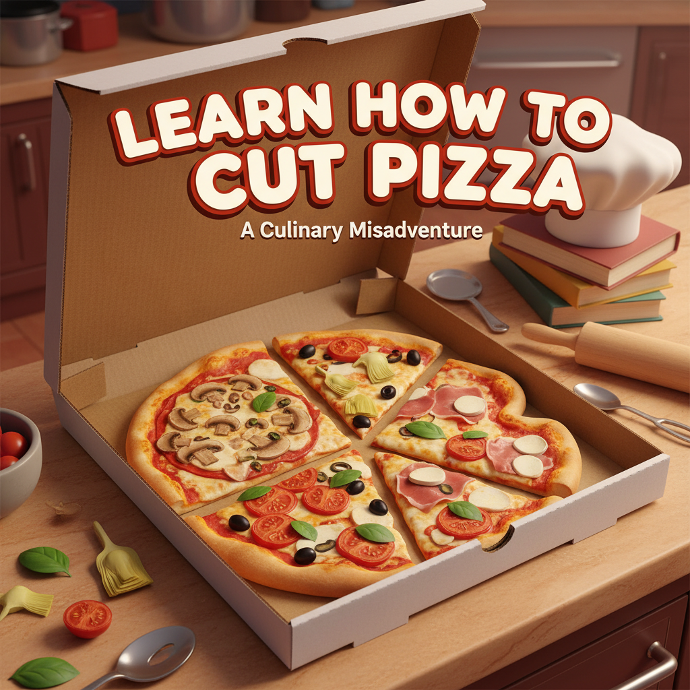

# **Are you cutting pizza in the wrong way? 🍕🍕🔪 - Yes**

**Have you ever wondered why you don't retrieve information well when implementing RAG and cutting documents at random places?**

Traditional RAG cuts pizza just in 8 pieces, despite this traditional way seems to be fair, take a deep look. You are not splitting ingredients in a smart AI manner

⭐️ Semantic chunking groups sentences using a meaning-based division, and aims to obtain complete information units.

| This repo has been writen by me for mentoring purposes, despite the dataset and images, which make AI funny to play with.

## **Traditional Pizza Recipe**

**Chunk 1: Historical Context and Popularization** `[0.18, -0.42, 0.85]`

Modern pizza was born in Naples, Italy, in the 18th century, but has a fascinating history of cultural exchange. Although flatbread with toppings existed since ancient times, pizza as we know it developed when tomatoes arrived from America in the 16th century. Initially viewed with suspicion, poor Neapolitans began using them on flatbread, creating the first "pizza al pomodoro." Pizza truly gained popularity in 1889 when pizzaiolo Raffaele Esposito created "Pizza Margherita" for Queen Margherita of Savoy. From Naples, it spread throughout Italy and then worldwide thanks to Italian immigration.

**Chunk 2: Ingredients (American Connection)** `[0.15, -0.51, 0.83]`

- **Tomatoes**: Originally from America, fundamental base for the sauce
- **Peppers** (optional): Also from America, for extra flavor
- **Wheat flour**: For the dough, cultivated in Italy but improved with New World techniques
- **Mozzarella**: Traditional Italian buffalo cheese
- **Fresh basil**: Italian Mediterranean herb
- **Olive oil**: Italian star product
- **Salt and pepper**: Basic seasonings

**Chunk 3: Preparation Process** `[0.09, -0.48, 0.76]`

1. Mix flour, water, yeast, and salt for the dough
2. Let rest until it doubles in size
3. Roll out the dough in a circular shape
4. Spread tomato sauce evenly
5. Add mozzarella in pieces
6. Bake at 480°F for 10-12 minutes
7. Garnish with fresh basil when it comes out

**Chunk 4: Consumption Culture** `[0.21, -0.39, 0.81]`

In Italy, pizza is cut into triangular portions and eaten with hands, slightly folding each piece. It's served hot, directly from the oven, and traditionally accompanied with light red wine or beer. Italians usually eat it for dinner, between 7 and 9 PM, and it's common to share it in family groups or with friends.

## **Advantages:**

✅ **Precise Retrieval**: When you ask "Where do pizza ingredients come from?", it directly retrieves Chunk 2 with complete ingredient information

✅ **Preserved Context**: Each chunk maintains complete information about its specific topic without fragmentation

✅ **Efficient Search**: Semantic vectors group related concepts together, improving relevance scoring

### Traditional chunking:

❌ **Arbitrary cuts**: Splits text every 500 words regardless of meaning

❌ **Broken context**: Cuts through related concepts and ideas

❌ **Information dilution**: Important relationships between sentences are lost

❌ **Poor retrieval**: Returns fragments that lack complete meaning
